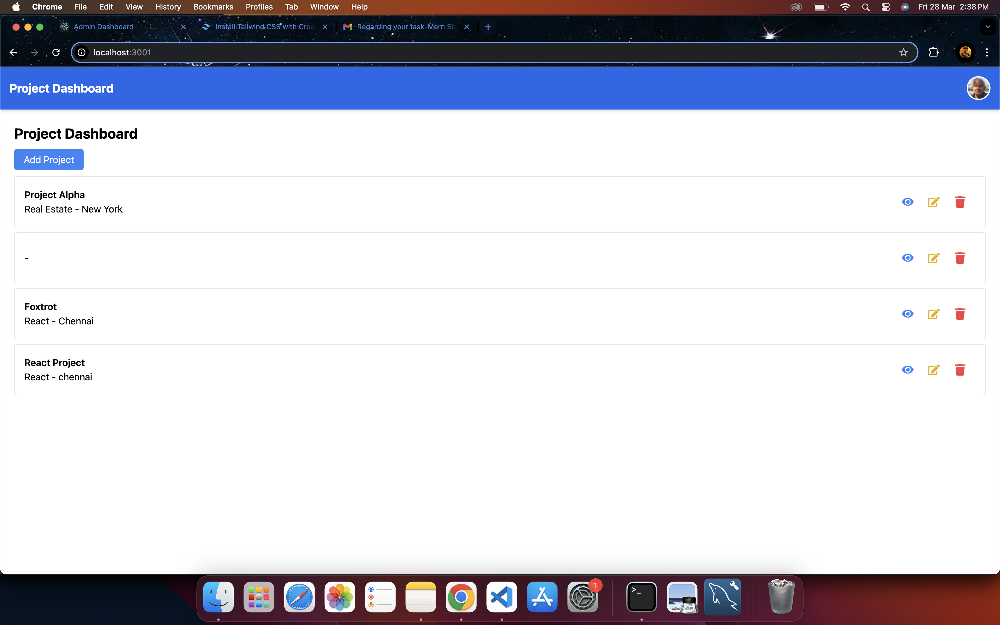
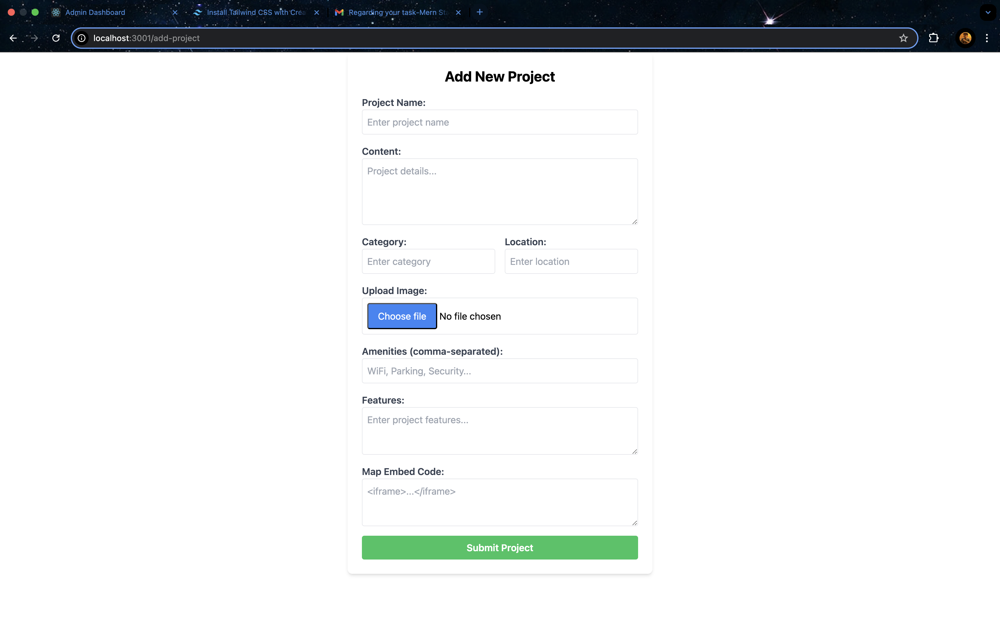

# Open Design - Admin Panel

## Overview

This project is a MERN stack-based **Admin Panel** for managing projects, using **PostgreSQL** as the database instead of MongoDB. The admin can **add, update, delete, and view projects** through a well-structured dashboard.

## Features

### 🔹 **Backend**
- **Authentication**: Secure admin login using **JWT & bcrypt**.
- **Project Management**: Routes and controller logic for adding, updating, and deleting projects.
- **Database**: Used **PostgreSQL** instead of Knex for data management.
- **API Endpoints**: RESTful API for project operations.

### 🔹 **Frontend**
- **Admin Panel UI**: Implemented `Dashboard` and `Add Project` pages.
- **Styling**: Built with **Tailwind CSS** for a modern, responsive design.

## 📸 UI Screenshots

### **Admin Dashboard**


### **Add Project Page**


---

## 🚀 Installation Guide

### Backend Setup
1. **Clone the repository:**
   ```sh
   git clone https://github.com/Belsinghferrus/open-design-admin
